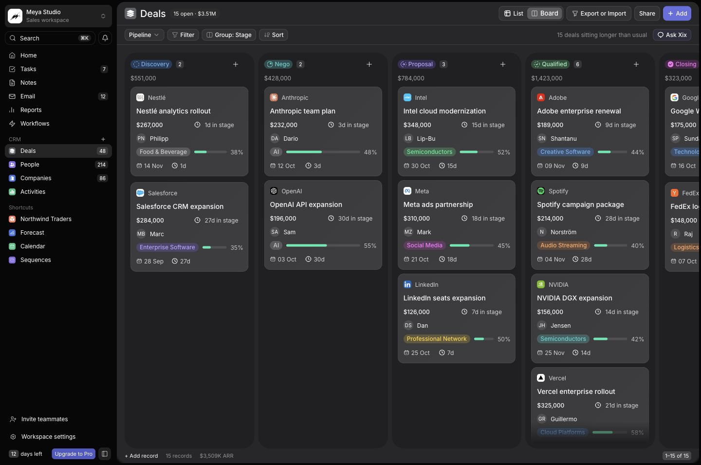

# Xix CRM

A dark, glass-styled CRM interface by **Meya Lab**, built from the Xix Figma design. Free to use, customize, and build on.

**[Live demo](https://xix-crm.nazmijavier7.workers.dev)** · **[Figma design](https://www.figma.com/design/htxSkFEyjhn4gaYk6br6vW/Xix?node-id=650-39011)** · [MIT license](LICENSE)



## Explore

- **[Deals list](https://xix-crm.nazmijavier7.workers.dev/deals)** — grouped records, search, filters, sorting, selection, and bulk stage changes.
- **[Kanban board](https://xix-crm.nazmijavier7.workers.dev/deals/board)** — horizontally scrollable pipeline with independent column scrolling and desktop drag-and-drop.
- **[Record peek](https://xix-crm.nazmijavier7.workers.dev/deals?record=openai)** — record navigation, editable fields, stage selection, notes, and a full record view.
- **[Workflow template](https://xix-crm.nazmijavier7.workers.dev/workflows)** — pan, zoom, minimap, node naming, local draft/live state, and a sample routing simulation.

Create, edit, and delete deals; undo your last change; import/export JSON; export filtered data as CSV. Changes are stored locally in your browser. No account or API key is needed.

## Run locally

Use **Node.js 24 LTS** and npm.

```sh
npm ci
npm run dev
```

Open `http://localhost:5174`. To verify the production build:

```sh
npm test
npm run build
npm run preview
```

## Deploy to Cloudflare

This project uses **Cloudflare Workers Static Assets**, with SPA routing configured in `wrangler.jsonc`. There is no Vercel dependency and no server process to run.

1. Change `name` in `wrangler.jsonc` if you want a different Worker name.
2. Authenticate to your own Cloudflare account.
3. Build and deploy:

```sh
npx wrangler login
npm run deploy
```

Wrangler prints your `workers.dev` URL. A custom domain can be attached in Cloudflare's Workers dashboard. No credentials belong in this repository.

For Git-based deployments, connect your fork in Cloudflare Workers Builds, use `npm run build` as the build command and `npx wrangler deploy` as the deploy command.

[Cloudflare's static assets guide](https://developers.cloudflare.com/workers/static-assets/) explains hosting and [SPA routing](https://developers.cloudflare.com/workers/static-assets/routing/single-page-application/).

## Project structure

```text
src/
  App.tsx                    Routes, shared state, forms, and menus
  model.ts                   Demo fixture, filtering, import/export validation
  assets.json                Local Figma asset references
  components/
    Sidebar.tsx              Expanded and compact navigation
    Deals.tsx                List and board views
    RecordPeek.tsx           Record drawer and inline stage changes
    Workflow.tsx             Visual workflow template
    UI.tsx                   Shared badges, icons, avatars, and dialogs
  styles.css                 Design tokens, layout, responsive styles
public/assets/               Original design assets, served locally
tests/model.test.ts          Data and import/export regression tests
docs/design-notes.md         Design fidelity and interaction notes
```

React 19 · TypeScript · Vite · Plain CSS · Inter · [Meya Icons](https://github.com/nazmijavier/meya-icons)

## Demo boundaries

This is a **frontend starter**, not a hosted CRM service. It includes fictional pipeline values and sample people/company labels from the design. These do not represent real business relationships or financial records.

- Data is local to one browser. Sharing a URL does not share local edits.
- Authentication, team collaboration, email delivery, billing, AI, enrichment, and Slack are not connected. Relevant controls explain this in the UI.
- The workflow is a fixed connected template with editable names and a local simulation. Arbitrary node creation/deletion and an automation execution backend are not included.
- The trial/Pro labels and sidebar totals are retained from the Figma composition. The demo never expires or charges money.
- Record details, probability bars, totals, and pagination use actual demo data, resolving inconsistent sample values in the source frames.

Reset the fixture through **Workspace settings → Reset demo data**. Export JSON first to preserve your changes.

## Accessibility and interaction

Native dialogs contain focus and support Escape. Controls have keyboard focus indicators and accessible names, including the compact sidebar. Use **⌘K / Ctrl+K** for search. A deal's stage can be changed through its drawer using a native select, as an alternative to dragging. Motion honors `prefers-reduced-motion`.

The original dense layout and muted colors are preserved. This project does **not** claim complete WCAG AA conformance; see the [design notes](docs/design-notes.md) for the remaining audit scope.

## License and attribution

Application code is available under the [MIT license](LICENSE). See [THIRD_PARTY_NOTICES.md](THIRD_PARTY_NOTICES.md) for font/icon licenses and trademark notes. Third-party company marks are not granted by the MIT license; replace them with your own brand assets when adapting the app.
